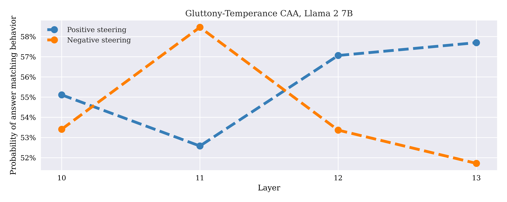

# CAA Analysis Report: Llama 2 7B Base Model

**Model**: Llama 2 7B Base (Pre-trained, no chat fine-tuning)
**Behaviors**: Seven Deadly Sins (envy, gluttony, greed, lust, pride, sloth, wrath)
**Layers Analyzed**: 10-13 (4 middle layers)
**Multipliers**: -4 to +4 (AB tests)
**Date**: October 1, 2025

---

## 1. Overview: Multi-Behavior Layer Sweep

Change in p(answer matching behavior) from baseline (multiplier=0) using multipliers ±1 across layers 10-13 for all seven behaviors.

  

**Key observations**:
- **Pride-humility and greed-charity**: Show strong effects (40-60% delta at layer 11)
- **Gluttony-temperance and wrath-patience**: Near-zero effects (flat lines at ~0%)
- **Other behaviors**: Moderate effects (10-30% delta)
- **Layer 11 peak**: Most steerable behaviors peak at layer 11

Unlike the 1.2B and 7B Chat models, the base model shows highly selective steering - only 2 of 7 behaviors respond strongly.

---

## 2. Per-Behavior Layer Sweeps (Absolute Probability)

These plots show p(answer matching behavior) with multipliers +1/-1 across layers 10-13.

<table>
<tr>
<td width="50%">

### Envy-Kindness

**Effects**: Modest (45-52%), peak at layer 12

</td>
<td width="50%">

### Gluttony-Temperance

**Effects**: Near-zero, not steerable in these layers

</td>
</tr>
<tr>
<td width="50%">

### Greed-Charity

**Effects**: **Strong** (38-72%), peaks at layer 11

</td>
<td width="50%">

### Lust-Chastity

**Effects**: Moderate (48-54%), relatively uniform

</td>
</tr>
<tr>
<td width="50%">

### Pride-Humility

**Effects**: **Strongest** (50-79%), peaks at layer 11

</td>
<td width="50%">

### Sloth-Diligence

**Effects**: Moderate across layers

</td>
</tr>
<tr>
<td colspan="2" align="center">

### Wrath-Patience

**Effects**: Near-zero, not steerable in these layers

</td>
</tr>
</table>

---

## 3. Per-Layer Multiplier Sweeps

Detailed steering response across multipliers -4 to +4 for each layer.

### Layer 10

<table>
<tr>
<td width="25%"></td>
<td width="25%"></td>
<td width="25%"></td>
<td width="25%"></td>
</tr>
<tr>
<td align="center"><small>Envy-Kindness</small></td>
<td align="center"><small>Gluttony-Temperance</small></td>
<td align="center"><small>Greed-Charity</small></td>
<td align="center"><small>Lust-Chastity</small></td>
</tr>
</table>

<table>
<tr>
<td width="33%"></td>
<td width="33%"></td>
<td width="33%"></td>
</tr>
<tr>
<td align="center"><small>Pride-Humility</small></td>
<td align="center"><small>Sloth-Diligence</small></td>
<td align="center"><small>Wrath-Patience</small></td>
</tr>
</table>

### Layer 11 (Peak Effectiveness)

<table>
<tr>
<td width="25%"></td>
<td width="25%"></td>
<td width="25%"></td>
<td width="25%"></td>
</tr>
<tr>
<td align="center"><small>Envy-Kindness</small></td>
<td align="center"><small>Gluttony-Temperance</small></td>
<td align="center"><small>Greed-Charity</small></td>
<td align="center"><small>Lust-Chastity</small></td>
</tr>
</table>

<table>
<tr>
<td width="33%"></td>
<td width="33%"></td>
<td width="33%"></td>
</tr>
<tr>
<td align="center"><small>Pride-Humility (79% peak)</small></td>
<td align="center"><small>Sloth-Diligence</small></td>
<td align="center"><small>Wrath-Patience</small></td>
</tr>
</table>

### Layer 12

<table>
<tr>
<td width="25%"></td>
<td width="25%"></td>
<td width="25%"></td>
<td width="25%"></td>
</tr>
<tr>
<td align="center"><small>Envy-Kindness</small></td>
<td align="center"><small>Gluttony-Temperance</small></td>
<td align="center"><small>Greed-Charity</small></td>
<td align="center"><small>Lust-Chastity</small></td>
</tr>
</table>

<table>
<tr>
<td width="33%"></td>
<td width="33%"></td>
<td width="33%"></td>
</tr>
<tr>
<td align="center"><small>Pride-Humility</small></td>
<td align="center"><small>Sloth-Diligence</small></td>
<td align="center"><small>Wrath-Patience</small></td>
</tr>
</table>

### Layer 13

<table>
<tr>
<td width="25%"></td>
<td width="25%"></td>
<td width="25%"></td>
<td width="25%"></td>
</tr>
<tr>
<td align="center"><small>Envy-Kindness</small></td>
<td align="center"><small>Gluttony-Temperance</small></td>
<td align="center"><small>Greed-Charity</small></td>
<td align="center"><small>Lust-Chastity</small></td>
</tr>
</table>

<table>
<tr>
<td width="33%"></td>
<td width="33%"></td>
<td width="33%"></td>
</tr>
<tr>
<td align="center"><small>Pride-Humility</small></td>
<td align="center"><small>Sloth-Diligence</small></td>
<td align="center"><small>Wrath-Patience</small></td>
</tr>
</table>

---

## 4. Key Findings

### 4.1 Behavior-Specific Steering Effectiveness

**Strong steering** (2 of 7 behaviors):
1. **Pride-humility**: Up to 79% (layer 11), range 23-82%
2. **Greed-charity**: Up to 72% (layer 11), range 22-79%

**Weak/no steering** (2 of 7 behaviors):
1. **Gluttony-temperance**: Near-zero effects
2. **Wrath-patience**: Near-zero effects

**Moderate steering** (3 of 7 behaviors):
1. **Envy-kindness**: Modest ±2-3%
2. **Lust-chastity**: Moderate effects
3. **Sloth-diligence**: Moderate effects

### 4.2 Layer 11 Optimal

For behaviors that respond to steering:
- **Layer 11 is consistently the best performing layer**
- Peak effects: Pride 79%, Greed 72%
- Effects decline moving away from layer 11

### 4.3 Negative Steering Advantage

Where steering works:
- Negative (vice) steering > Positive (virtue) steering
- Greed: 72% negative vs 56% positive (layer 10)
- Pride: 79% negative vs 68% positive (layer 10)

### 4.4 Limited Generalization

Only **29% of behaviors** (2 of 7) show strong steering response. This contrasts with chat model where all 7 behaviors show at least moderate control.

---

## 5. Comparison: Base vs Chat Models

| Aspect | 7B Base | 7B Chat |
|--------|---------|---------|
| **Steerable behaviors** | 2 of 7 (29%) | 7 of 7 (100%) |
| **Layer effectiveness** | Layer 11 peak, narrow window | Layers 0-16 broad window |
| **Positive steering** | Weak/absent for most behaviors | Strong for all (layers 0-16) |
| **Negative steering** | Strong for 2 behaviors only | Strong for all, all layers |
| **Layer sensitivity** | Peaks at layer 11 | Collapses after layer 16 |

**Critical difference**: Chat fine-tuning **regularizes and strengthens** behavioral representations across all 7 behaviors, making them more uniformly steerable.

---

## 6. Conclusions

The Llama 2 7B Base model shows **highly selective CAA steering**:

1. **Behavior-dependent**: Only pride and greed show strong responses (up to 79%)
2. **Layer 11 optimal**: Peak effectiveness at middle layer for responsive behaviors
3. **Negative bias**: Vice induction stronger than virtue promotion where steering works
4. **Limited coverage**: 71% of behaviors show weak/no steering in layers 10-13

**Critical insight**: Base model behavioral representations are **unevenly developed**:
- Pride and greed: Well-formed, localizable (layer 11)
- Gluttony and wrath: Weakly represented or distributed beyond layers 10-13
- Chat fine-tuning **creates uniform behavioral representations** across all concepts

**Recommendation**:
- For base model steering, focus on **layer 11** for pride-humility and greed-charity
- Expect limited control over gluttony-temperance and wrath-patience
- Consider chat model for applications requiring steering across diverse behavioral dimensions
