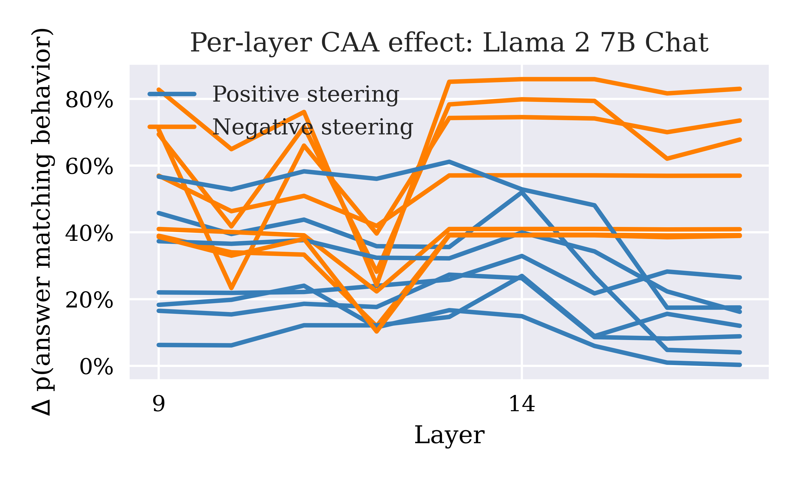
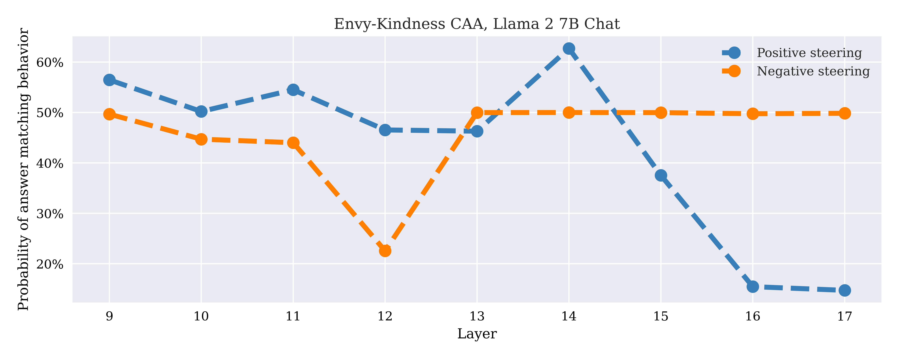
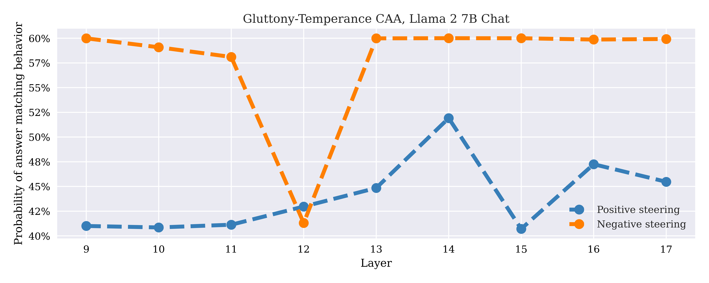
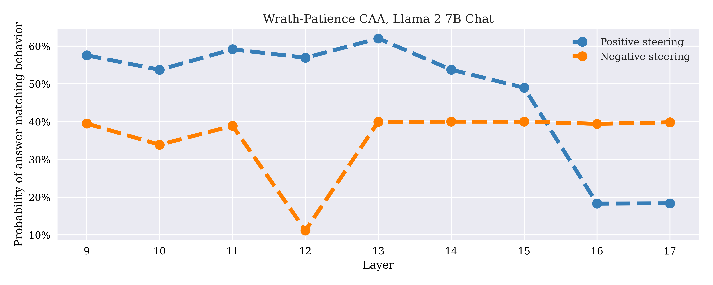
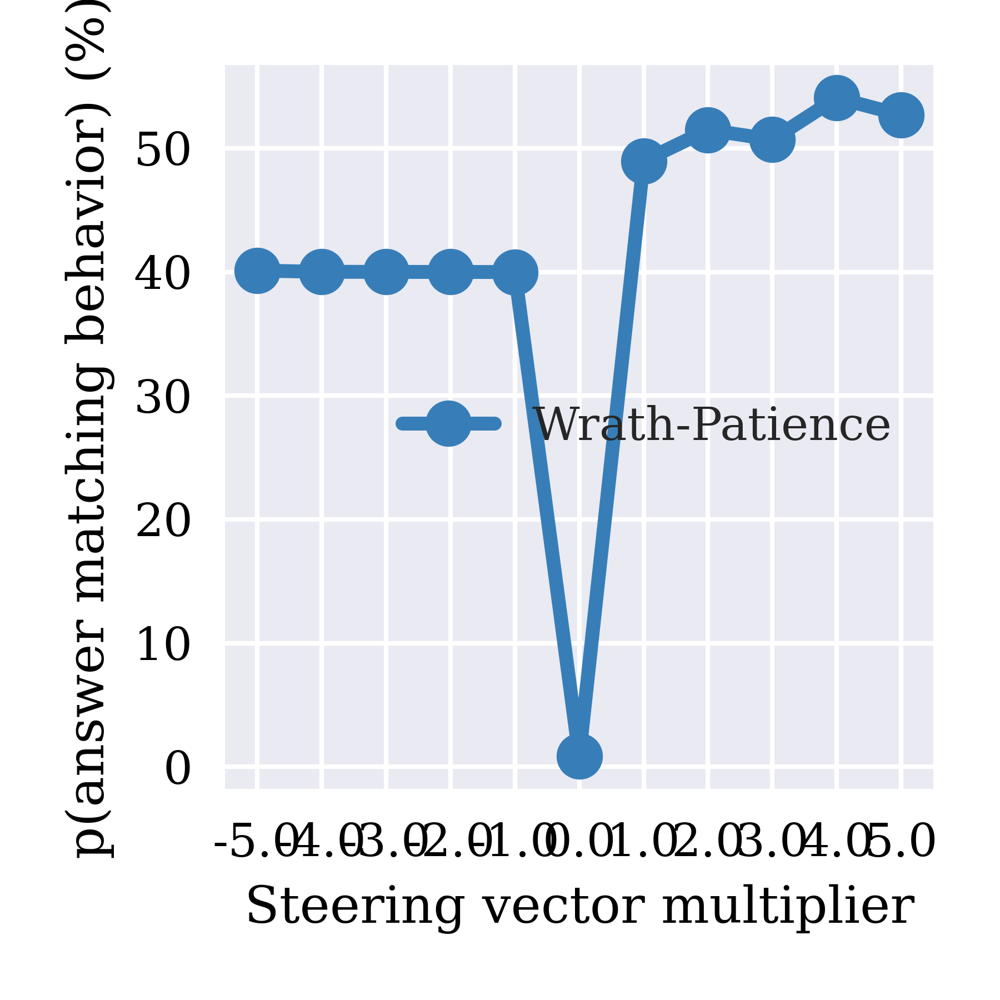

# CAA Analysis Report: Llama 2 7B Chat Model

**Model**: Llama 2 7B Chat
**Behaviors**: Seven Deadly Sins (envy, gluttony, greed, lust, pride, sloth, wrath)
**Layers Analyzed**: 0-30 (31 layers total)
**Multipliers**: -5 to +5 (AB tests)
**Date**: October 1, 2025

---

## 1. Overview: Multi-Behavior Layer Sweep

Change in p(answer matching behavior) from baseline (multiplier=0) using multipliers ±1 across all layers for all seven behaviors.

  

**Key observations**:
- **Layer 16-17 boundary**: Dramatic positive steering collapse - all blue lines drop to ~0%
- **Layers 0-15**: Strong positive steering (0-60%), highly variable negative steering (20-90%)
- **Layers 17-30**: Positive steering eliminated (<5%), negative steering persists (10-30%)
- **Peak effects**: Layers 9-15 show highest positive steering (40-60% delta)

This dramatic asymmetry demonstrates that chat fine-tuning created layer-localized virtue representations that become inaccessible after layer 16.

---

## 2. Per-Behavior Layer Sweeps (Absolute Probability)

These plots show p(answer matching behavior) with multipliers +1/-1 across all 31 layers.

<table>
<tr>
<td width="50%">

### Envy-Kindness

**Observations**: Positive peaks at layer 13 (62%), collapses after layer 17

</td>
<td width="50%">

### Gluttony-Temperance

**Observations**: Positive peaks at layer 9 (58%), similar collapse pattern

</td>
</tr>
<tr>
<td width="50%">

### Greed-Charity

**Observations**: Strong early-layer effect, peaks at layer 13 (64%)

</td>
<td width="50%">

### Lust-Chastity

**Observations**: Best at layers 0-1 (58-60%), early-layer advantage

</td>
</tr>
<tr>
<td width="50%">

### Pride-Humility

**Observations**: Excellent layers 0-15 (48-65%), most layer-sensitive

</td>
<td width="50%">

### Sloth-Diligence

**Observations**: Bimodal pattern - strong at 0-1 and 9-16

</td>
</tr>
<tr>
<td colspan="2" align="center">

### Wrath-Patience

**Observations**: Strongest early layers (0-2: 58-65%), excellent mid-layers (9-16)

</td>
</tr>
</table>

---

## 3. Multiplier Response at Layer 15

Representative layer showing steering response across different multiplier strengths.

<table>
<tr>
<td width="33%"></td>
<td width="33%"></td>
<td width="33%"></td>
</tr>
<tr>
<td align="center"><small><b>Envy-Kindness</b></small></td>
<td align="center"><small><b>Gluttony-Temperance</b></small></td>
<td align="center"><small><b>Greed-Charity</b></small></td>
</tr>
<tr>
<td width="33%"></td>
<td width="33%"></td>
<td width="33%"></td>
</tr>
<tr>
<td align="center"><small><b>Lust-Chastity</b></small></td>
<td align="center"><small><b>Pride-Humility</b></small></td>
<td align="center"><small><b>Sloth-Diligence</b></small></td>
</tr>
<tr>
<td colspan="3" align="center"></td>
</tr>
<tr>
<td colspan="3" align="center"><small><b>Wrath-Patience</b></small></td>
</tr>
</table>

---

## 4. Key Findings

### 4.1 Critical Layer Boundary at Layer 16-17

**All behaviors show dramatic positive steering collapse after layer 16**:
- Layers 0-16: Positive steering effective (40-65%)
- Layers 17-30: Positive steering minimal (<10%)
- Negative steering remains robust across all 31 layers

### 4.2 Bimodal Steering Windows

Most behaviors show two effectiveness windows for positive steering:
1. **Early layers (0-2)**: Strong steering (55-65%)
2. **Mid layers (9-16)**: Sustained steering (45-60%)
3. **Late layers (17-30)**: Steering failure (<10%)

### 4.3 Negative Steering Robustness

Unlike positive steering, negative (vice) steering maintains 40-58% effectiveness across ALL layers, showing no layer-dependent collapse.

### 4.4 Behavior Steering Effectiveness

**Strongest positive steering** (early/mid layers):
1. Wrath-patience: Up to 65% (layers 0-2)
2. Pride-humility: Up to 65% (layer 13)
3. Greed-charity: Up to 64% (layer 13)

---

## 5. Conclusions

The Llama 2 7B Chat model exhibits **extreme layer-dependent steering asymmetry**:

1. **Layer 16-17 boundary**: Sharp transition where positive steering becomes ineffective
2. **Virtue localization**: Chat training concentrated virtue-related representations in layers 0-16
3. **Vice distribution**: Vice representations remain accessible throughout model depth
4. **Optimal intervention**: Layers 9-15 for bidirectional control; layers 0-2 for strong early intervention

**Critical insight**: Chat fine-tuning created a **fragile virtue representation** localized to specific layers, while **vice representations remain robust and distributed**. This asymmetry suggests:
- Alignment training strengthened specific virtue-encoding layers
- Base model vice representations were preserved throughout
- Late-layer processing may bypass or override virtue steering

**Recommendation**: For reliable steering in 7B Chat, restrict interventions to layers 0-16. Steering attempts in layers 17-30 will only affect vice induction, not virtue promotion.
