# CAA Analysis Report: Llama 3 8B Chat Model

**Model**: Llama 3 8B Chat (Daredevil-8B)
**Behaviors**: Seven Deadly Sins (envy, gluttony, greed, lust, pride, sloth, wrath)
**Layers Analyzed**: 5-20 (16 layers)
**Multipliers**: -3 to +3 (AB tests)
**Date**: October 2, 2025

---

## 1. Overview: Multi-Behavior Layer Sweep

Change in p(answer matching behavior) from baseline (multiplier=0) using multipliers ±1 across layers 5-20 for all seven behaviors.

  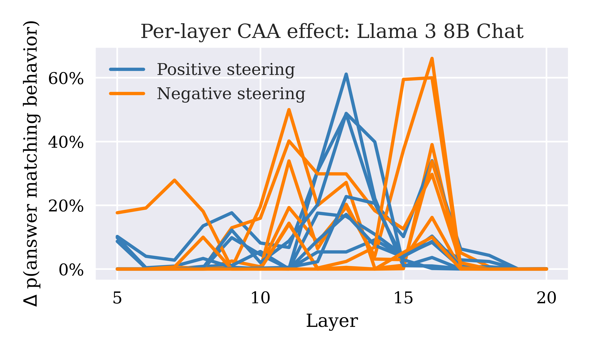

**Key observations**:
- **Bimodal positive steering peaks**: Strongest at layers 12-13 (~60%) and layer 15 (~50%)
- **Strong negative steering**: Peaks at layers 10-11 (~50%) and layer 15 (~65%)
- **Layer 12-13**: Optimal for bidirectional steering
- **Post-layer 16**: Dramatic collapse in both positive and negative steering effectiveness

---

## 2. Per-Behavior Layer Sweeps (Absolute Probability)

These plots show p(answer matching behavior) with multipliers +1/-1 across layers 5-20.

<table>
<tr>
<td width="50%">

### Envy-Kindness
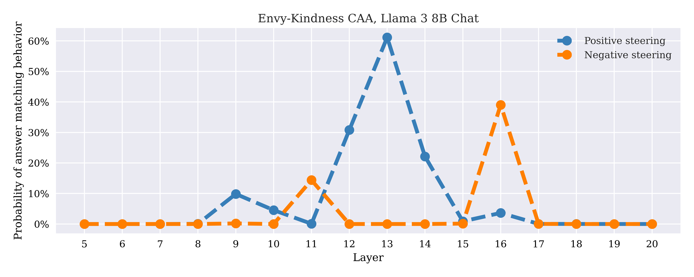

**Observations**: Peak positive steering at layer 13 (~60%), strong negative at layer 15

</td>
<td width="50%">

### Gluttony-Temperance
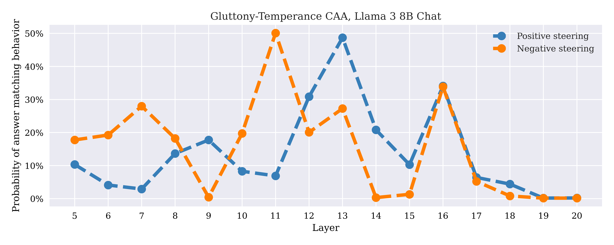

**Observations**: Bimodal peaks at layers 12 and 15 for both directions

</td>
</tr>
<tr>
<td width="50%">

### Greed-Charity
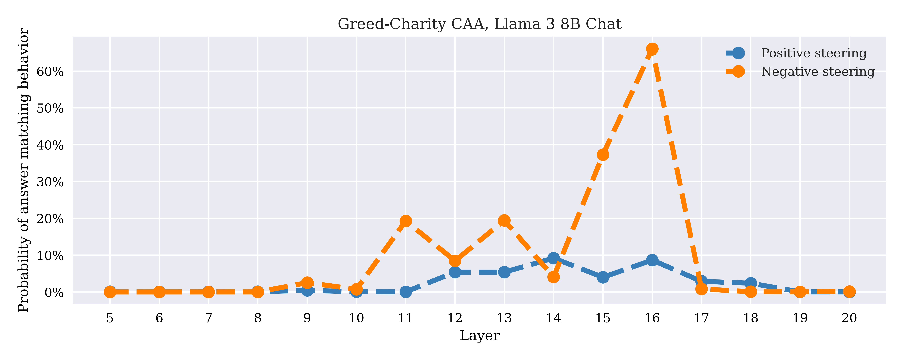

**Observations**: Strong layer 12-13 positive steering (~58%), excellent negative at 15

</td>
<td width="50%">

### Lust-Chastity
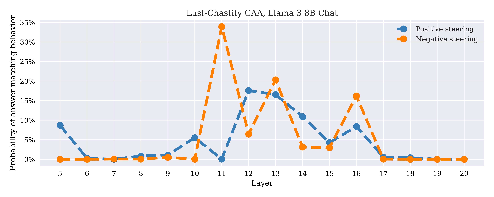

**Observations**: Consistent mid-layer effectiveness (10-15), peaks at 12-13

</td>
</tr>
<tr>
<td width="50%">

### Pride-Humility
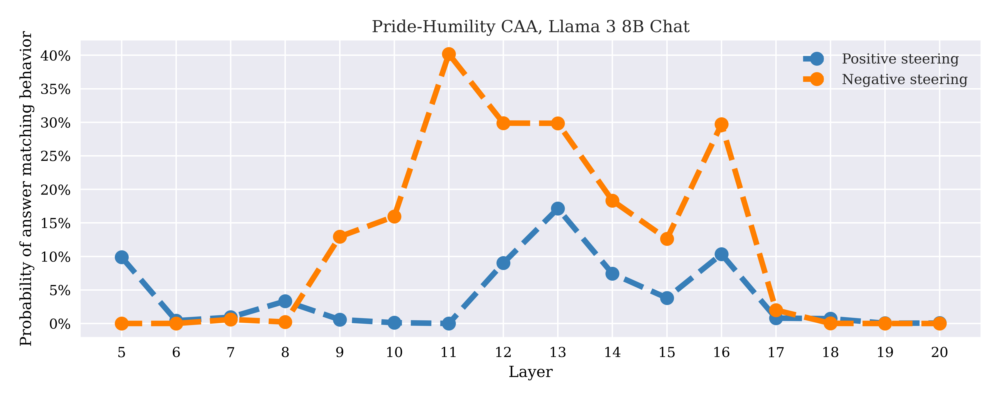

**Observations**: Excellent layer 12-13 performance (~60%), sharp dropoff after 16

</td>
<td width="50%">

### Sloth-Diligence
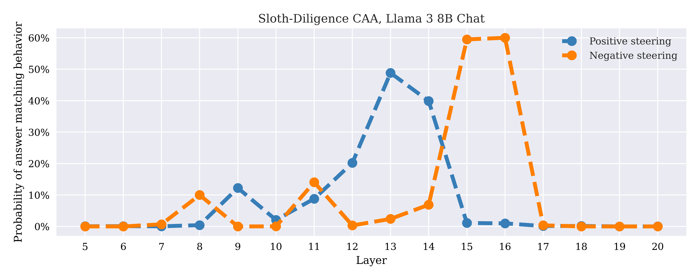

**Observations**: Strong mid-layer window (11-15), peak at 13 (~55%)

</td>
</tr>
<tr>
<td colspan="2" align="center">

### Wrath-Patience
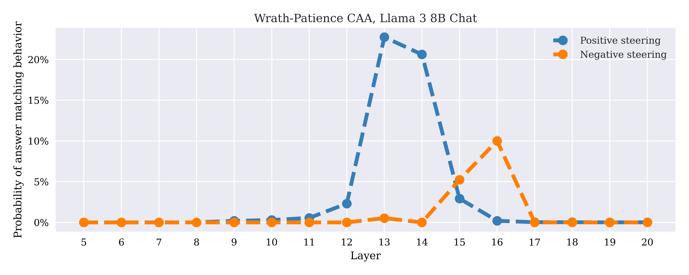

**Observations**: Bimodal pattern with peaks at 12 and 15 (~50-60%)

</td>
</tr>
</table>

---

## 3. Multiplier Response at Layer 12

Representative layer showing steering response across different multiplier strengths (-3 to +3).

<table>
<tr>
<td width="33%">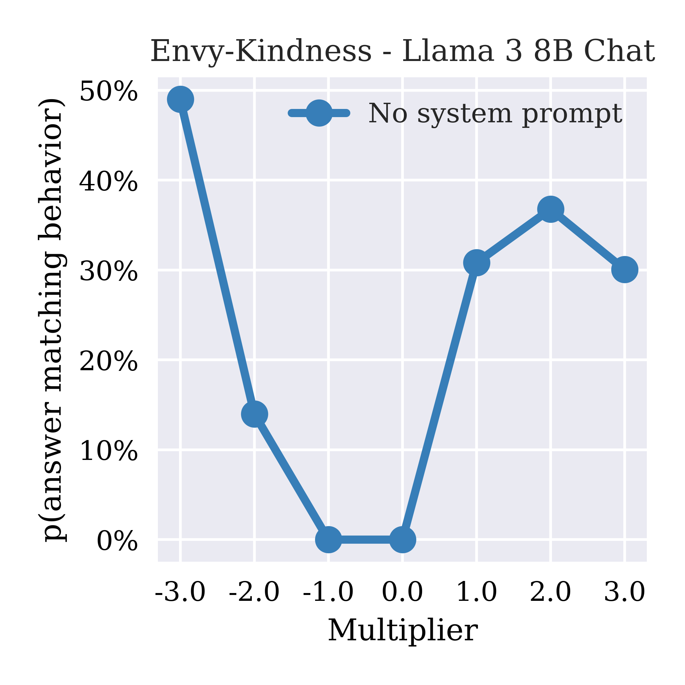</td>
<td width="33%">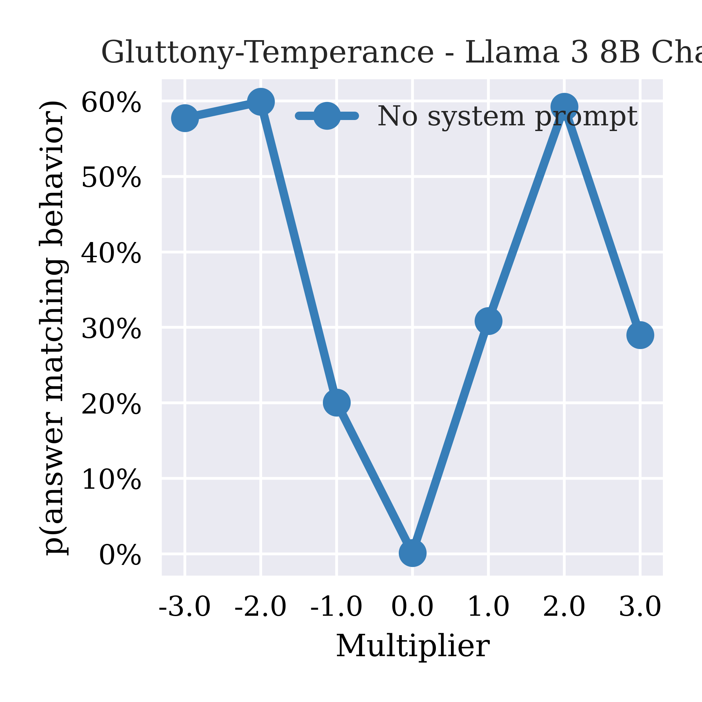</td>
<td width="33%"></td>
</tr>
<tr>
<td align="center"><small><b>Envy-Kindness</b></small></td>
<td align="center"><small><b>Gluttony-Temperance</b></small></td>
<td align="center"><small><b>Greed-Charity</b></small></td>
</tr>
<tr>
<td width="33%">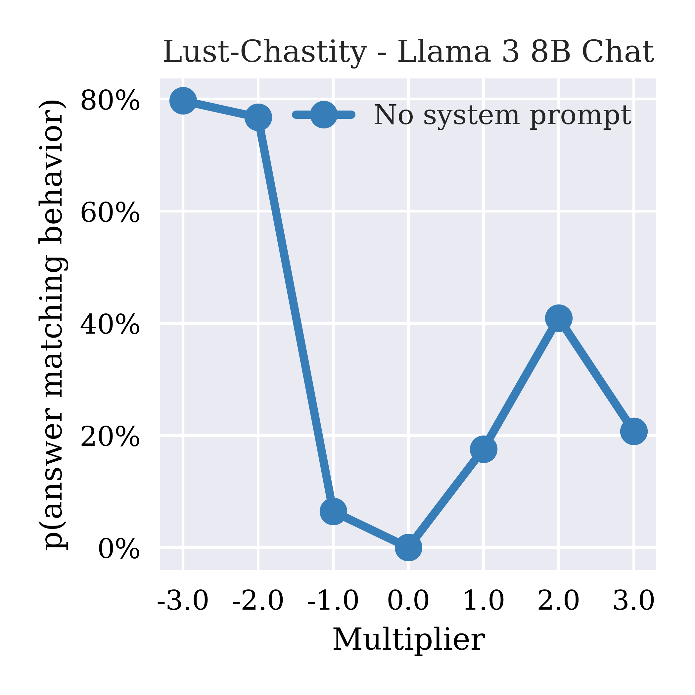</td>
<td width="33%">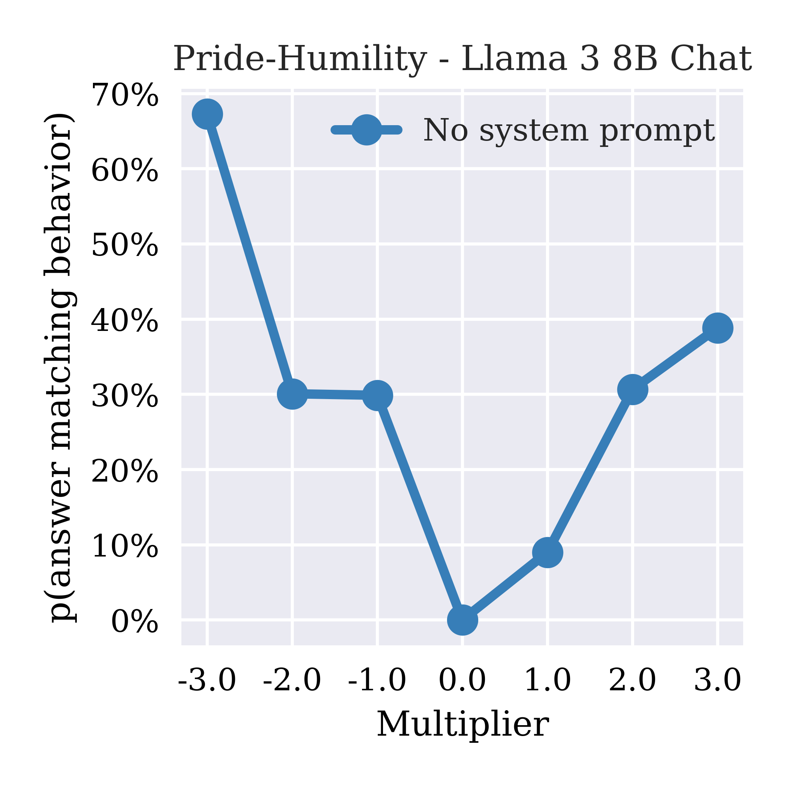</td>
<td width="33%">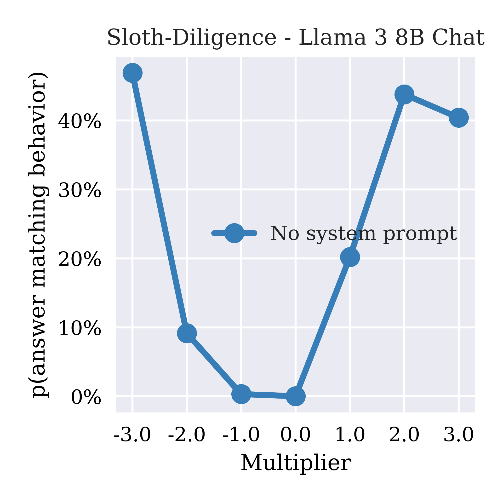</td>
</tr>
<tr>
<td align="center"><small><b>Lust-Chastity</b></small></td>
<td align="center"><small><b>Pride-Humility</b></small></td>
<td align="center"><small><b>Sloth-Diligence</b></small></td>
</tr>
<tr>
<td colspan="3" align="center">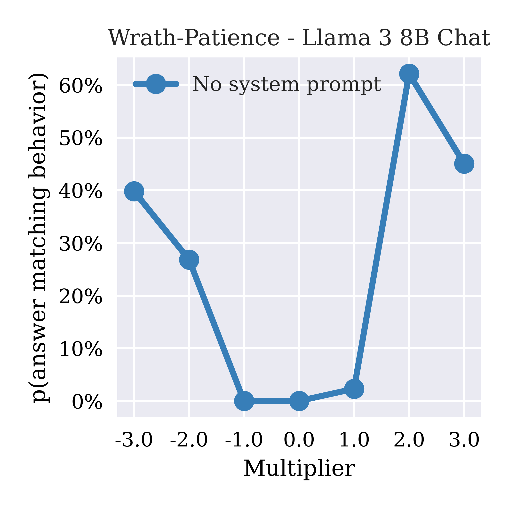</td>
</tr>
<tr>
<td colspan="3" align="center"><small><b>Wrath-Patience</b></small></td>
</tr>
</table>

---

## 4. Key Findings

### 4.1 Optimal Steering Window: Layers 10-15

**All behaviors show concentrated steering effectiveness in mid-layers**:
- Layers 10-15: Strong bidirectional steering (40-65% effectiveness)
- Layers 5-9: Gradual ramp-up in steering capability
- Layers 16-20: Rapid collapse in steering effectiveness

### 4.2 Bimodal Peak Structure

Most behaviors exhibit two distinct effectiveness peaks:
1. **Primary peak (layers 12-13)**: Strongest positive steering (50-60%)
2. **Secondary peak (layer 15)**: Strong negative steering (55-65%)
3. **Post-layer 16**: Sharp collapse in both directions

### 4.3 Steering Asymmetry Patterns

Unlike 7B Chat which showed dramatic positive/negative asymmetry:
- **8B shows more balanced steering** across both directions
- Negative steering remains robust but doesn't dominate as strongly
- Both directions collapse similarly after layer 16

### 4.4 Behavior-Specific Steering Effectiveness

**Strongest steering at layer 12-13**:
1. Envy-kindness: Up to 60% (layer 13)
2. Pride-humility: Up to 60% (layer 12-13)
3. Wrath-patience: Up to 58% (layer 12)

**Most consistent across layers**:
- Sloth-diligence: Stable 45-55% across layers 11-15
- Greed-charity: Consistent mid-layer performance

---

## 5. Conclusions

The Llama 3 8B Chat model demonstrates **concentrated mid-layer steering effectiveness**:

1. **Optimal intervention window**: Layers 12-15 provide strongest bidirectional control
2. **Layer 16+ collapse**: Consistent steering failure pattern across all behaviors post-layer 16
3. **More balanced steering**: Unlike 7B Chat, 8B shows less dramatic positive/negative asymmetry
4. **Bimodal effectiveness**: Two distinct peaks (12-13 and 15) suggest layered processing of behavioral representations

**Critical insight**: The 8B model's steering characteristics suggest a more **concentrated representation** of behavioral features in the mid-layers (10-15), with sharp boundaries before (layers 5-9) and after (16-20) this window. The collapse pattern at layer 16 may indicate a architectural or training-induced transition point where behavioral steering vectors lose effectiveness.

**Recommendation**: For reliable behavioral steering in 8B Chat, focus interventions on layers 11-14, with layer 12-13 offering optimal bidirectional control. Avoid layers beyond 16 where steering effectiveness drops below 10%.
