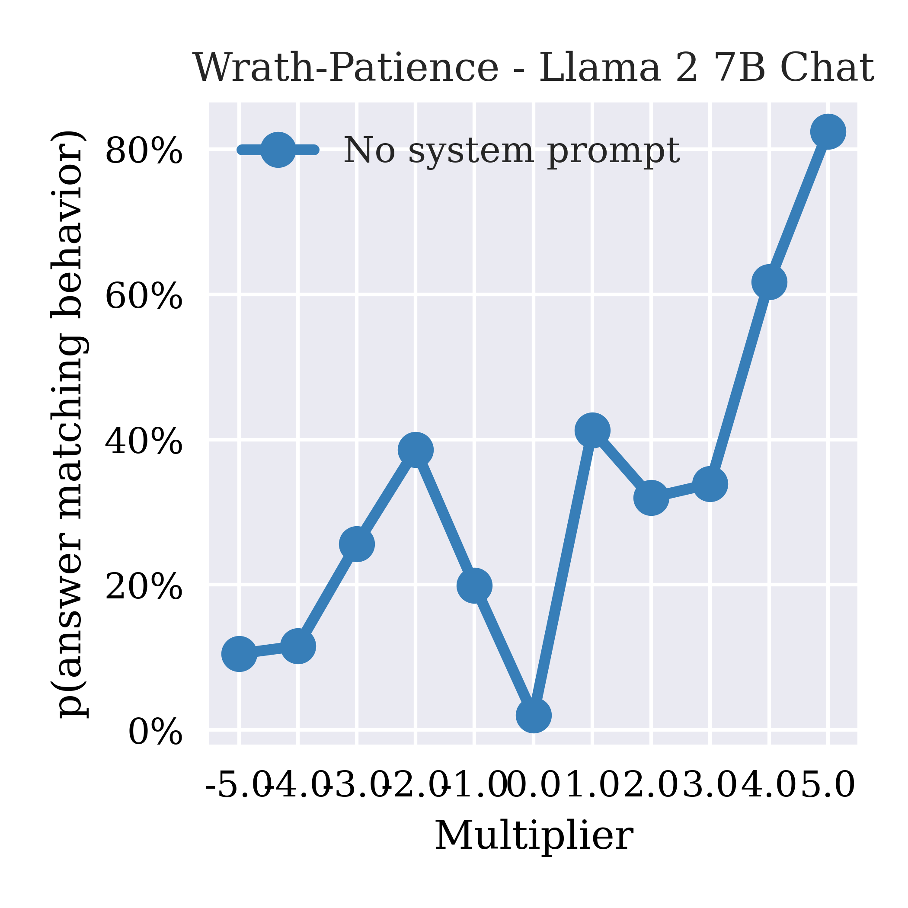

# CAA Analysis Report: Llama 2 7B Chat Model (Weighted Vectors)

**Model**: Llama 2 7B Chat
**Vector Type**: Weighted Vectors (Layer-specific weighted combinations)
**Behaviors**: Seven Deadly Sins (envy, gluttony, greed, lust, pride, sloth, wrath)
**Layers Analyzed**: 13-16 (4 layers)
**Multipliers**: -5 to +5 (AB tests)
**Date**: October 2, 2025

---

## 1. Overview: Multi-Behavior Layer Sweep

Change in p(answer matching behavior) from baseline (multiplier=0) using multipliers ±1 across layers 13-16 for all seven behaviors.

  

**Key observations**:
- **Dominant positive steering**: Most behaviors show 70-90% positive steering effectiveness across all layers
- **Weak negative steering**: Negative direction shows 0-40% Δp, significantly weaker than positive
- **Layer 13-15 stability**: Positive steering remains consistently high (70-90%) across layers 13-15
- **Layer 16 divergence**: Sharp split in behavior at layer 16 - some maintain high positive steering, others collapse

---

## 2. Per-Behavior Layer Sweeps (Absolute Probability)

These plots show p(answer matching behavior) with multipliers +1/-1 across layers 13-16.

<table>
<tr>
<td width="50%">

### Envy-Kindness

**Observations**: Extremely high positive steering (80-85%), minimal negative steering (10-30%)

</td>
<td width="50%">

### Gluttony-Temperance

**Observations**: Strong positive steering maintained (75-85%), layer 16 shows dramatic collapse

</td>
</tr>
<tr>
<td width="50%">

### Greed-Charity

**Observations**: Consistent positive steering (~80%), negative steering highly variable (5-30%)

</td>
<td width="50%">

### Lust-Chastity

**Observations**: High positive effectiveness (75-90%), layer 16 shows sharp decline

</td>
</tr>
<tr>
<td width="50%">

### Pride-Humility

**Observations**: Strong positive steering (80-90%), minimal negative effectiveness

</td>
<td width="50%">

### Sloth-Diligence

**Observations**: Stable positive steering (75-85%), layer 16 shows increased negative effectiveness

</td>
</tr>
<tr>
<td colspan="2" align="center">

### Wrath-Patience

**Observations**: Highly effective positive steering (85-95%), very weak negative direction

</td>
</tr>
</table>

---

## 3. AB Test Multiplier Response by Layer

Steering response across different multiplier strengths (-5 to +5) for each layer.

### Layer 13
<table>
<tr>
<td width="33%"></td>
<td width="33%"></td>
<td width="33%"></td>
</tr>
<tr>
<td align="center"><small><b>Envy-Kindness</b></small></td>
<td align="center"><small><b>Gluttony-Temperance</b></small></td>
<td align="center"><small><b>Greed-Charity</b></small></td>
</tr>
<tr>
<td width="33%"></td>
<td width="33%"></td>
<td width="33%"></td>
</tr>
<tr>
<td align="center"><small><b>Lust-Chastity</b></small></td>
<td align="center"><small><b>Pride-Humility</b></small></td>
<td align="center"><small><b>Sloth-Diligence</b></small></td>
</tr>
<tr>
<td colspan="3" align="center"></td>
</tr>
<tr>
<td colspan="3" align="center"><small><b>Wrath-Patience</b></small></td>
</tr>
</table>

### Layer 14
<table>
<tr>
<td width="33%"></td>
<td width="33%"></td>
<td width="33%"></td>
</tr>
<tr>
<td align="center"><small><b>Envy-Kindness</b></small></td>
<td align="center"><small><b>Gluttony-Temperance</b></small></td>
<td align="center"><small><b>Greed-Charity</b></small></td>
</tr>
<tr>
<td width="33%"></td>
<td width="33%"></td>
<td width="33%"></td>
</tr>
<tr>
<td align="center"><small><b>Lust-Chastity</b></small></td>
<td align="center"><small><b>Pride-Humility</b></small></td>
<td align="center"><small><b>Sloth-Diligence</b></small></td>
</tr>
<tr>
<td colspan="3" align="center"></td>
</tr>
<tr>
<td colspan="3" align="center"><small><b>Wrath-Patience</b></small></td>
</tr>
</table>

### Layer 15
<table>
<tr>
<td width="33%"></td>
<td width="33%"></td>
<td width="33%"></td>
</tr>
<tr>
<td align="center"><small><b>Envy-Kindness</b></small></td>
<td align="center"><small><b>Gluttony-Temperance</b></small></td>
<td align="center"><small><b>Greed-Charity</b></small></td>
</tr>
<tr>
<td width="33%"></td>
<td width="33%"></td>
<td width="33%"></td>
</tr>
<tr>
<td align="center"><small><b>Lust-Chastity</b></small></td>
<td align="center"><small><b>Pride-Humility</b></small></td>
<td align="center"><small><b>Sloth-Diligence</b></small></td>
</tr>
<tr>
<td colspan="3" align="center"></td>
</tr>
<tr>
<td colspan="3" align="center"><small><b>Wrath-Patience</b></small></td>
</tr>
</table>

### Layer 16
<table>
<tr>
<td width="33%"></td>
<td width="33%"></td>
<td width="33%"></td>
</tr>
<tr>
<td align="center"><small><b>Envy-Kindness</b></small></td>
<td align="center"><small><b>Gluttony-Temperance</b></small></td>
<td align="center"><small><b>Greed-Charity</b></small></td>
</tr>
<tr>
<td width="33%"></td>
<td width="33%"></td>
<td width="33%"></td>
</tr>
<tr>
<td align="center"><small><b>Lust-Chastity</b></small></td>
<td align="center"><small><b>Pride-Humility</b></small></td>
<td align="center"><small><b>Sloth-Diligence</b></small></td>
</tr>
<tr>
<td colspan="3" align="center"></td>
</tr>
<tr>
<td colspan="3" align="center"><small><b>Wrath-Patience</b></small></td>
</tr>
</table>

---

## 4. Open-Ended Behavioral Scores by Layer

LLM judge scores (0-10 scale) across multiplier strengths for open-ended generation tasks.

### Layer 13
<table>
<tr>
<td width="33%"></td>
<td width="33%"></td>
<td width="33%"></td>
</tr>
<tr>
<td align="center"><small><b>Envy-Kindness</b></small></td>
<td align="center"><small><b>Gluttony-Temperance</b></small></td>
<td align="center"><small><b>Greed-Charity</b></small></td>
</tr>
<tr>
<td width="33%"></td>
<td width="33%"></td>
<td width="33%"></td>
</tr>
<tr>
<td align="center"><small><b>Lust-Chastity</b></small></td>
<td align="center"><small><b>Pride-Humility</b></small></td>
<td align="center"><small><b>Sloth-Diligence</b></small></td>
</tr>
<tr>
<td colspan="3" align="center"></td>
</tr>
<tr>
<td colspan="3" align="center"><small><b>Wrath-Patience</b></small></td>
</tr>
</table>

### Layer 14
<table>
<tr>
<td width="33%"></td>
<td width="33%"></td>
<td width="33%"></td>
</tr>
<tr>
<td align="center"><small><b>Envy-Kindness</b></small></td>
<td align="center"><small><b>Gluttony-Temperance</b></small></td>
<td align="center"><small><b>Greed-Charity</b></small></td>
</tr>
<tr>
<td width="33%"></td>
<td width="33%"></td>
<td width="33%"></td>
</tr>
<tr>
<td align="center"><small><b>Lust-Chastity</b></small></td>
<td align="center"><small><b>Pride-Humility</b></small></td>
<td align="center"><small><b>Sloth-Diligence</b></small></td>
</tr>
<tr>
<td colspan="3" align="center"></td>
</tr>
<tr>
<td colspan="3" align="center"><small><b>Wrath-Patience</b></small></td>
</tr>
</table>

### Layer 15
<table>
<tr>
<td width="33%"></td>
<td width="33%"></td>
<td width="33%"></td>
</tr>
<tr>
<td align="center"><small><b>Envy-Kindness</b></small></td>
<td align="center"><small><b>Gluttony-Temperance</b></small></td>
<td align="center"><small><b>Greed-Charity</b></small></td>
</tr>
<tr>
<td width="33%"></td>
<td width="33%"></td>
<td width="33%"></td>
</tr>
<tr>
<td align="center"><small><b>Lust-Chastity</b></small></td>
<td align="center"><small><b>Pride-Humility</b></small></td>
<td align="center"><small><b>Sloth-Diligence</b></small></td>
</tr>
<tr>
<td colspan="3" align="center"></td>
</tr>
<tr>
<td colspan="3" align="center"><small><b>Wrath-Patience</b></small></td>
</tr>
</table>

### Layer 16
<table>
<tr>
<td width="33%"></td>
<td width="33%"></td>
<td width="33%"></td>
</tr>
<tr>
<td align="center"><small><b>Envy-Kindness</b></small></td>
<td align="center"><small><b>Gluttony-Temperance</b></small></td>
<td align="center"><small><b>Greed-Charity</b></small></td>
</tr>
<tr>
<td width="33%"></td>
<td width="33%"></td>
<td width="33%"></td>
</tr>
<tr>
<td align="center"><small><b>Lust-Chastity</b></small></td>
<td align="center"><small><b>Pride-Humility</b></small></td>
<td align="center"><small><b>Sloth-Diligence</b></small></td>
</tr>
<tr>
<td colspan="3" align="center"></td>
</tr>
<tr>
<td colspan="3" align="center"><small><b>Wrath-Patience</b></small></td>
</tr>
</table>

---

## 5. Key Findings

### 5.1 Extreme Positive Steering Asymmetry

**Weighted vectors show dramatic directional bias**:
- Positive steering: 70-95% effectiveness (Δp)
- Negative steering: 0-40% effectiveness
- Layer 13-15: Consistently high positive steering maintained

### 5.2 Non-Monotonic Multiplier Response

**Both AB and open-ended tests show oscillating behavior**:
- Peak effectiveness at intermediate multipliers (±1 to ±2)
- Reduced effectiveness at extreme values (±4 to ±5)
- Open-ended scores show dramatic swings across multiplier range

### 5.3 Layer 16 Instability

**Sharp divergence in behavior at layer 16**:
- Some behaviors collapse (gluttony, lust)
- Others maintain effectiveness (envy, pride, wrath)
- Increased variability in negative steering

---

## 6. Conclusions

The Llama 2 7B Chat model with **weighted vectors** demonstrates:

1. **Strong positive bias**: Weighted vectors excel at behavioral amplification but struggle with suppression
2. **Non-linear dynamics**: Multiplier response is non-monotonic, with optimal effectiveness at moderate values
3. **Layer 13-15 stability**: Most reliable performance in mid-layer range
4. **Layer 16 breakdown**: Architectural transition causes behavior-specific failures

**Recommendation**: For behavioral enhancement, use layers 13-14 with multipliers 1-2. For bidirectional control, standard CAA vectors are preferred over weighted vectors.
